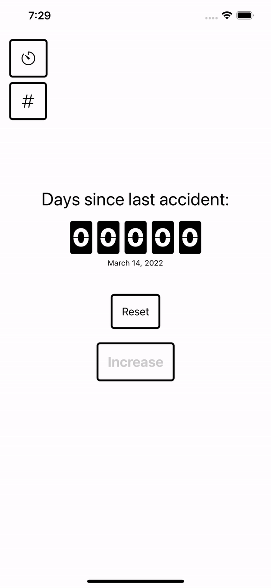
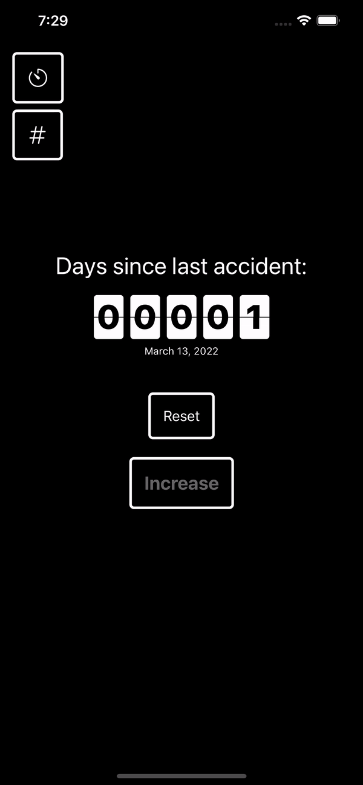

# Flip counter implementation in SwiftUI

Flip counter is a simple, aesthetic app written in SwiftUI and a forked from [elpassion/FlipClock-SwiftUI](https://github.com/elpassion/FlipClock-SwiftUI).
The app let's you flip a simple counter over one number at a time. Ideal for keeping track of your streaks.

|Light|Dark|
|:-:|:-:|
|||

## License

Copyright © 2019 [EL Passion](https://www.elpassion.com)

Copyright © 2022 [Henrik Storch](https://thisisthefoxe.me)

License: [GNU GPLv3](LICENSE)
